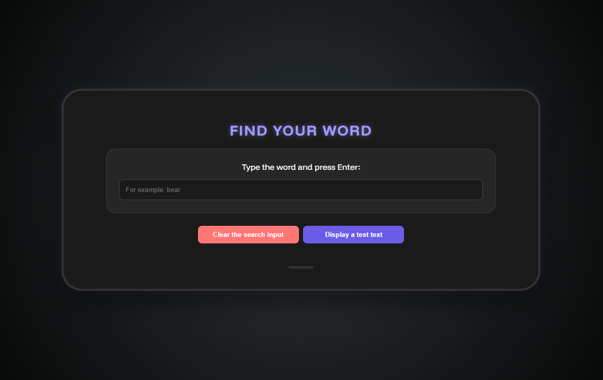
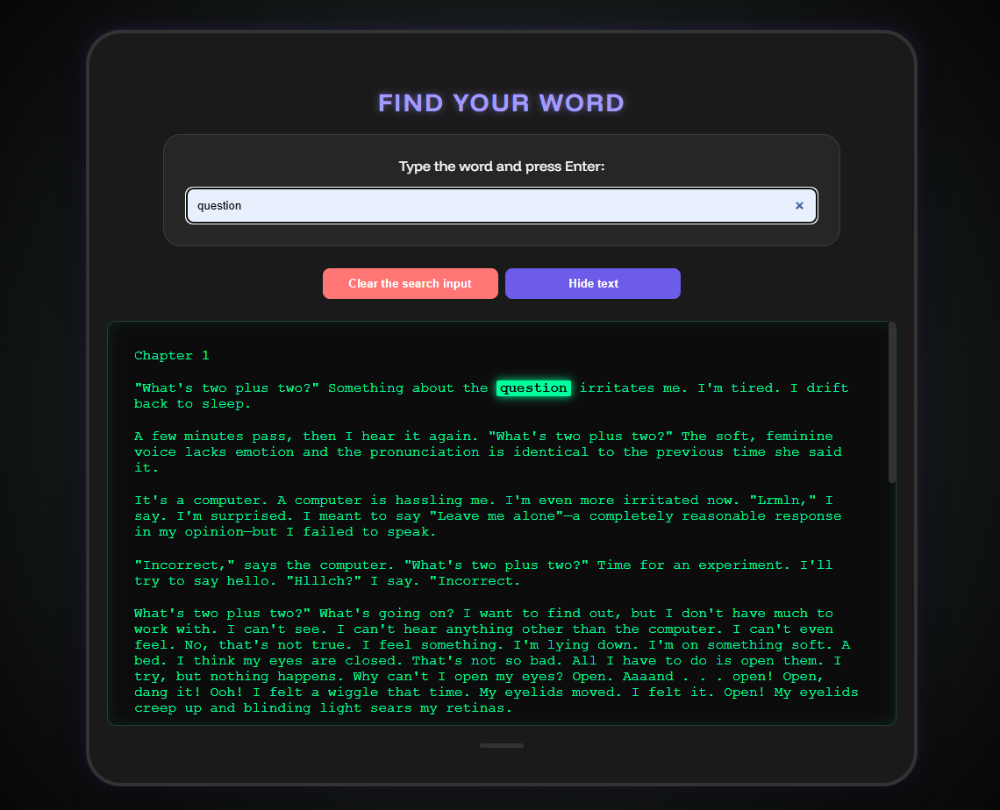
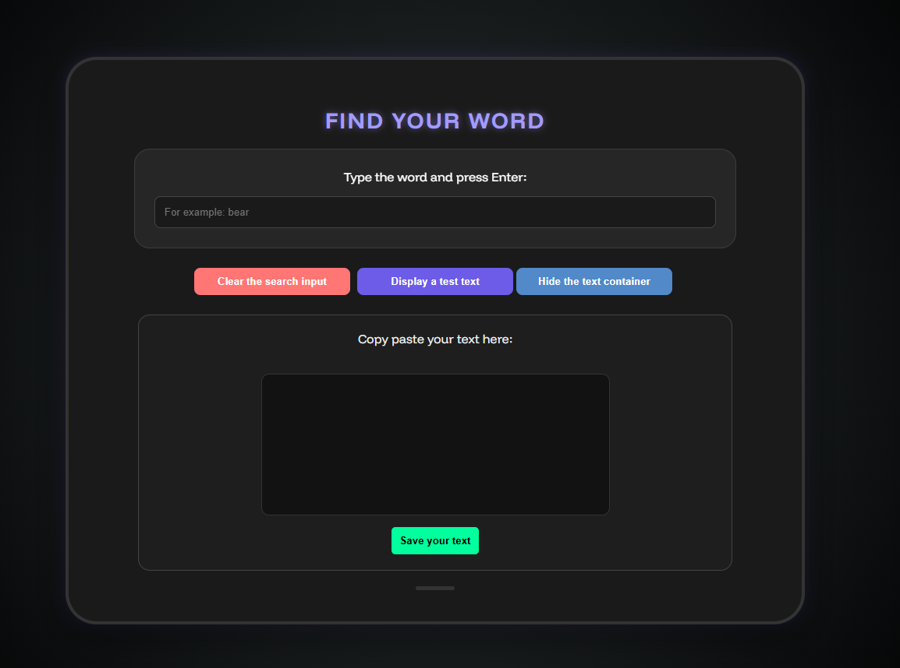

# find-your-word

📖 Find Your Word:

An interactive text-exploration tool built with Vanilla JavaScript, featuring a sci-fi interface inspired by Andy Weir's Project Hail Mary.

Users can toggle the text visibility, search for specific words with real-time highlighting, and receive smart feedback based on the search state.

✨ Features:

- Toggle Visibility: Smoothly reveal or hide the text with a custom CSS animation.

- Custom Input: Users can now paste their own text into a virtual terminal to search through personal documents or different stories.

- Intelligent Search: Uses Regular Expressions (RegExp) to find and highlight every instance of a word throughout the text.

- UX Validation: \* Prevents searching if the text isn't displayed yet.

- Warns the user if the search input is empty.

- Alerts the user if the word is not found in the excerpt.

- Responsive Design: Optimized for both desktop and mobile viewing with a "glassmorphism" UI style.

- Reset Functionality: Quickly clear highlights and inputs to start over.

🛠️ Tech Stack:

- HTML5: Semantic structure for accessibility.

- CSS3: Custom animations, Flexbox layout, and backdrop filters for the glassmorphism effect.

- JavaScript (ES6+): DOM manipulation, event listeners, and Regular Expressions.

- Google Fonts: "Funnel Display" for a modern, clean look.

📝 How to Use:

- Click "Display a test text" to reveal the book chapter (to test the app).

- Click 'Add here your text' to open the input terminal, paste your content, and hit 'Save' to load it into the tablet

- Type a word (e.g., "computer" or "two") into the search bar.

- Press Enter to see all matches highlighted in green.

- Click "Clear the search input" or "Hide text" to reset the view.

## 👤 Author

Ana Sappia Rey - Frontend Developer

